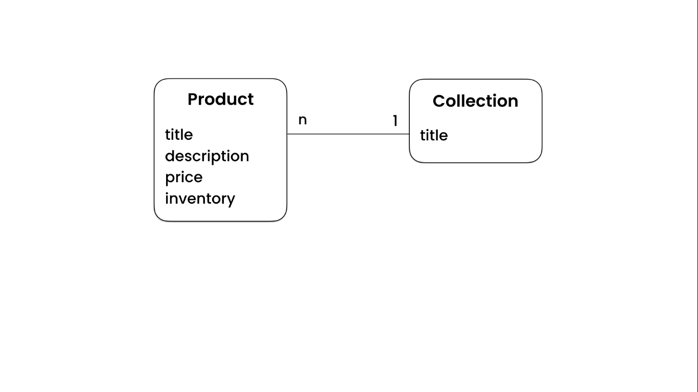
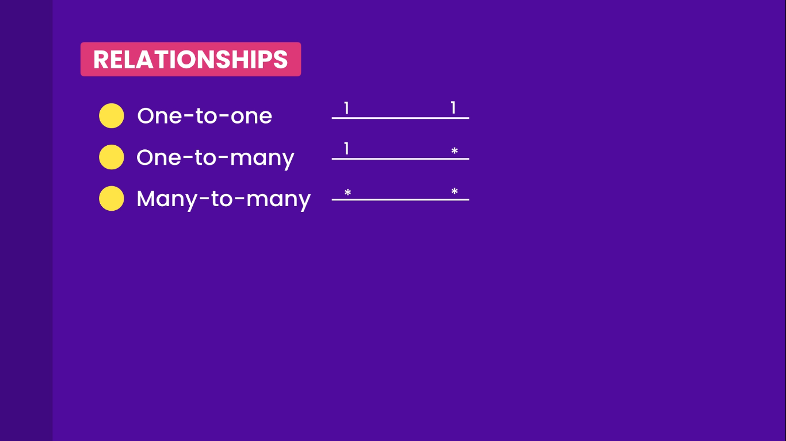
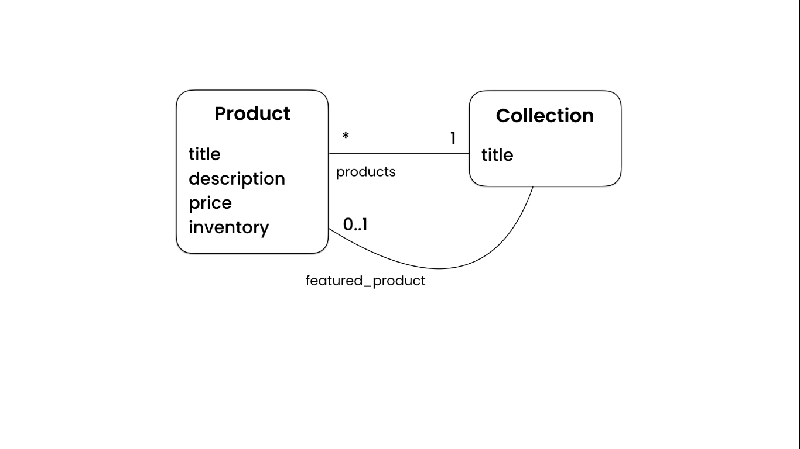

# Building a Data Model

## Intro To Data Modeling

The first step in every Django project is figuring out the pieces of data we want to store.

What concepts and entities do we have in an E-commerce app:

for starters we need:

Product:

1. title
2. description
3. price
4. inventory

Quite often our products are divide into different categories like: shoes, beauty-products, fruits and so on.

so we need another entity called `collection` or `category`

Collection:

- title

so now we need to make a relation or association between these entities so we can start from one end and move to the other end. for example we can take a collection and find all the products in that collection.



```txt

Product                       collection
          *___one to many__1
title                         title
description
price
inventory


```

relationships cab be




Great question! Let’s break down this diagram step by step so you fully understand the **relationships** and how they fit into data modeling.

---

### 1️⃣ **Entities in the Diagram**

We have two entities (tables/models):

- **Product**

  - Fields: `title`, `description`, `price`, `inventory`

- **Collection**

  - Fields: `title`

These represent **real-world objects**:

- A **Product** is something you sell (e.g., "iPhone 14").
- A **Collection** is a group/category of products (e.g., "Smartphones").

---

### 2️⃣ **Relationships Between Them**

There are **two relationships** shown:

#### 🔹 (A) `products` (One-to-Many: 1 ↔ \*)

- A **Collection** can contain **many Products**.
- But **each Product belongs to exactly ONE Collection**.
  Example:

  - Collection: "Laptops"

    - Product 1: MacBook Pro
    - Product 2: Dell XPS
    - Product 3: Lenovo ThinkPad

✅ In Django:

- `Product` will have a `ForeignKey` pointing to `Collection`.

---

#### 🔹 (B) `featured_product` (Optional 0..1)

This is the **special (0..1) relationship** you asked about:

- A **Collection** can have **zero or one featured product**.

  - 0 means: It’s optional (not all collections need a featured product).
  - 1 means: At most one product can be "featured" in a collection.

Example:

- Collection: "Smartphones" → Featured Product: iPhone 14
- Collection: "Laptops" → Featured Product: (none)

✅ In Django:

- `Collection` will have a `featured_product` field, which is a `ForeignKey` to `Product` but marked as `null=True` (optional).

---

### 3️⃣ **Why Both Relationships Exist?**

Even though **`products`** already connects products to collections,
the **`featured_product`** is a **special pointer** to highlight ONE product within that collection.

Think of it like:

- `products`: all items in the collection (general list).
- `featured_product`: one special "spotlight" product in that collection.

---

### 4️⃣ **How it Looks in Django Models**

```python
class Collection(models.Model):
    title = models.CharField(max_length=255)
    featured_product = models.ForeignKey(
        'Product',
        on_delete=models.SET_NULL,
        null=True,
        related_name='+'
    )

class Product(models.Model):
    title = models.CharField(max_length=255)
    description = models.TextField()
    price = models.DecimalField(max_digits=10, decimal_places=2)
    inventory = models.IntegerField()
    collection = models.ForeignKey(Collection, on_delete=models.PROTECT, related_name='products')
```

---

### ✅ **Key Takeaways**

- **One-to-many** (`products`): One collection → many products.
- **Optional one-to-one-ish** (`featured_product`): One collection → zero or one highlighted product.
- The **0..1 notation** means it’s an **optional relationship**, unlike `*` (many) or `1` (required).

---
